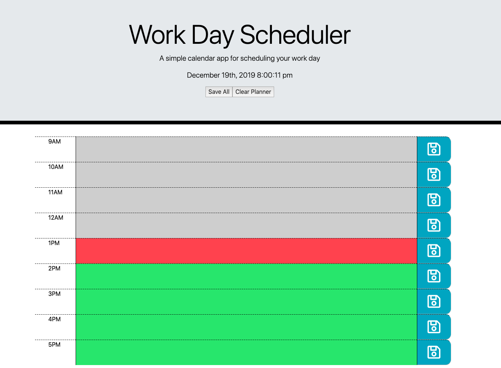

# Day-Planner

Preview Site
https://livingkurt.github.io/Day-Planner/

## Pitch

Are you someone that has a lot to do, and no way to keep track of it all?
Do you find yourself looking for a pencil and paper but your forgot how to write?

Well I have the app for you!!

I created a website that can keep track of your daily tasks quick and efficient!

## What is it?

A Calender app that allows you to create save and recall your todos from your busy day to day.

Opening up this app for the first time you will notice 9 color coordinated rows associated with the time of day during work.
Next to each hour slot you add in whatever it is you would like to do.

Whether it may be

* Eating Lunch
* Filing paperwork
* Or hanging out by your companies water station

The power is in your hands!!

## Functionality

You have the option to type into the colored text fields and then save each field individually after you are done writing each task

Or you can type all of your tasks out and then save all of them at once with the button on the top.

When you are done for the day, you can use the "Clear Planner" button next to the "Save All" button, to clear it out for a fresh start tomorrow.

The date and time is also shown at the top in real time so you are never late for meeting!

## Color Key

* Red is Now
* Gray is in the past
* Green is in the future

